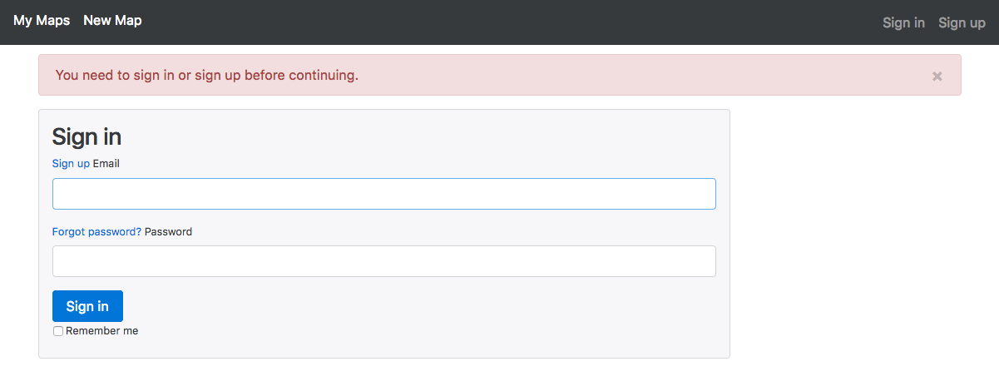
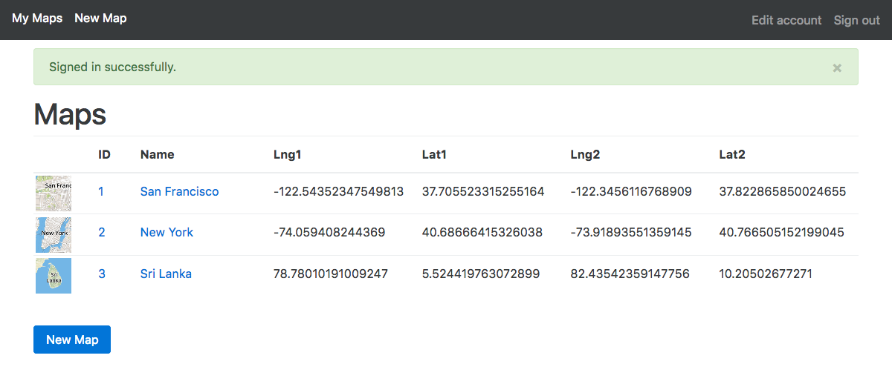
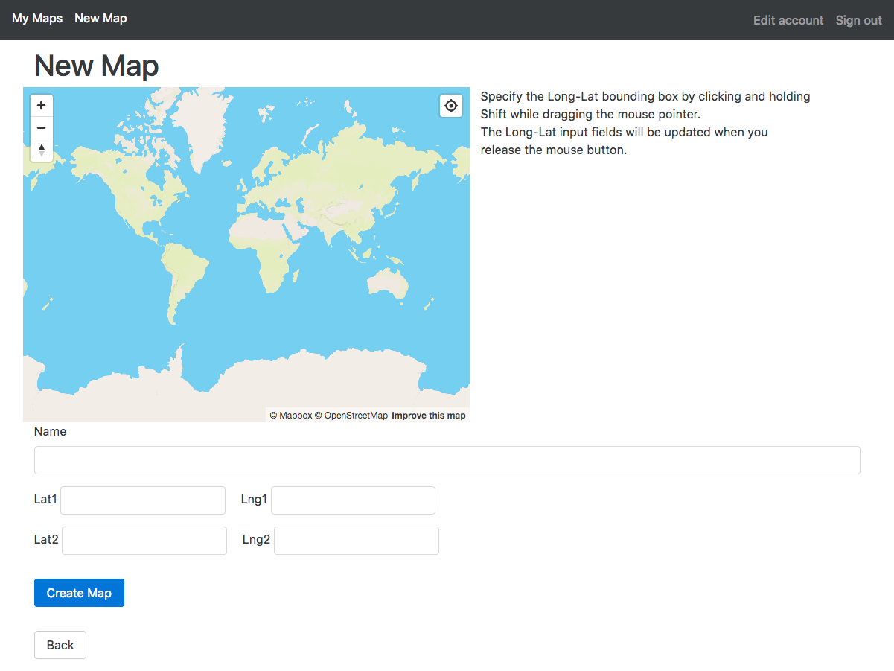
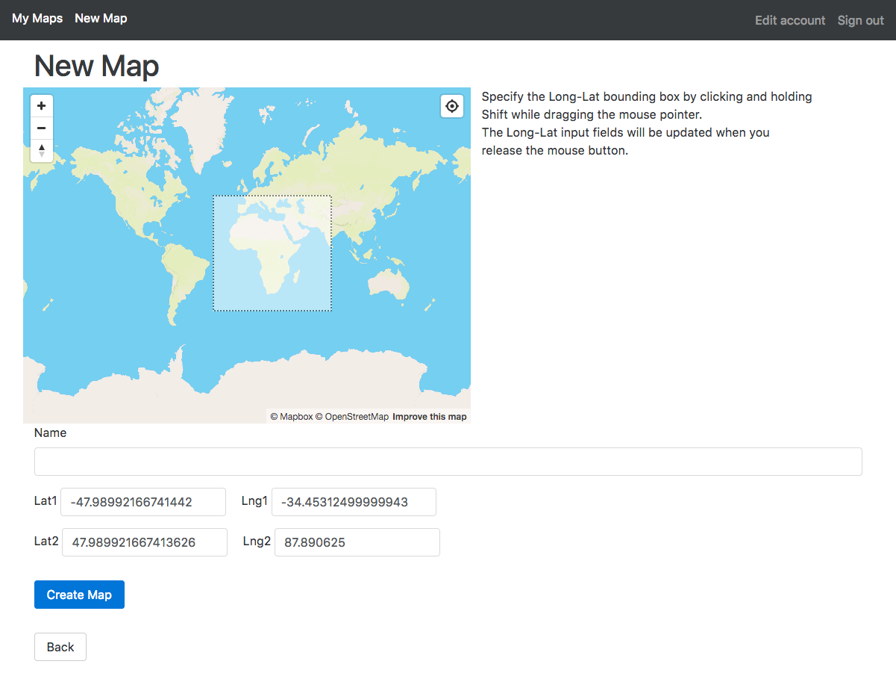

# Mapbox Map Test - Indika

## Instructions

### Signup and Login to the System
1. A user account is required to login to the system
   - Use the default test account.
   - or create an account by clicking the "Sign Up" link.
2. Once logged in the user is taken to the Maps page.
   - For new users this will be empty.
   - If you are using the test account, there will be several maps listed.




### Browsing Maps
1. The homepage contains a list of maps that belong the user you are logged in as.
2. The map thumbnails in the list give an approximate representation of the map.
3. You may view a map by clicking on the name, ID, or thumbnail image of a map.
   - This map page (`/maps/:map_id`) displays the map in read only mode.
   - You can pan and zoom the map and even zoom using a bounding box, but this will not change
     the map coordinates saved with the map.
     - Refreshing the page will reload the saved values.




### Creating a Map
1. The user can use the "New Map" buttons on the homepage and top navigation bar to navigate to the map creation page.
2. Clicking the button takes the user to `/maps/new` where the user is presented with
   a Mapbox map view as well as several input fields for *Map Name*, *Longitude*
   and *Latitude* coordinates of the new map's bounding box.
3. When the page is loaded the map is zoomed out to display the entire world and the name and longitude-latitude fields are empty. 
4. The map name is optional, but it is highly recommended that one be used.
5. All longitude-latitude coordinate values for the map's bounding box are required.
   - The user can enter this using the keyboard or
   - the user can specify the bounding box by clicking and dragging the mouse while holding the
     `Shift` key down.
     - The bounding box coordinates are copied to the input fields on Mouse-up.
6. Once the user clicks the "Create Map" button the map will be created (unless there are validation errors)
   and the user will be re-redirected to the map's *Edit* page.





### Editing a Map
1. Clicking the *Edit* but while viewing a map allows you to edit the maps.


### Preview on Heroku

The project can be viewed on Heroku at the URL below:

https://oc-indika.herokuapp.com/


### Run from Source Code

Unpack the sourcecode:
```bash
tar xvfz oc-indika.tar.gz
```

or clone from Github

```bash
git clone https://github.com/ijayasin/oc-indika.git
```

Basic usage instruction can be found in `README.md`.

```bash
cd oc-indika
less README.md
```

Install Ruby gems specified in the `Gemfile`.

```bash
# Install Ruby gems
bundle install
```

You may change the database settings by editing `config/database.yml`.
Run migrations and seed sample data.

```bash
bin/rake db:migrate
bin/rake db:seed
```

Now you should be able to run the server

```bash
# Run the server and browse!
bin/rails server
open 'http://127.0.0.1:3000'
```

Enjoy!
